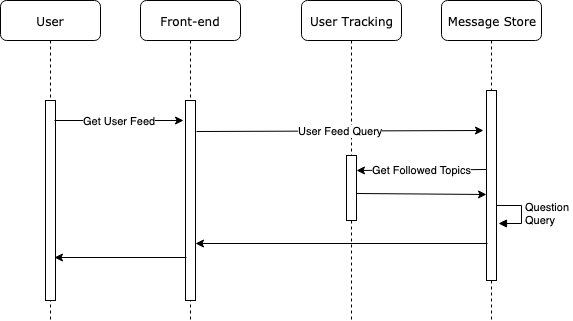

## Week Apr. 7- Apr. 13
After discussion, we have decided to implement a "clone" of Quora.com. 

#### Backend includes following GO APIs:

* User Authentication:  User SignUp, User Login, JWT token assign and verify

* User Activities:  Follow/Unfollow questions and topics, Feed questions to user in `/Home` page

* Questions: Get/Add/Update questions,answers and comments

#### Frontend:     ReactJS


### Responsibilitis:

* Yu Zhao: Frontend design and implementation
* Yueqiao Zhang: User Activities API
* Hongzhe Yang: User Authentication API
* David Ronca: Messaging API (CWMAPI)

## Week Apr. 14 - Apr. 21

After discussion on Slake group and meetup after class, we have discussed following topics:

* Achitechture Design of Quora Application
* Dependency between backend GO APIs

### Progress:
* ReactJS: 
    * [API Doc](https://docs.google.com/spreadsheets/d/1M4RdDfX2pyHF5RVmjj8jFG7bgsPhhCXzO-LWUfgFXt8/edit?usp=sharing ) (for Frontend-Backend communication only, include Method, API Endpoint, request params/body schema, and response schema)
    * UI Design
    * SignUp, Login and Home Page (with faked backend)

* Quesions:

* User Activities:
    * Set up mongoDB for user follow activities
    * Set up Docker file to build go API
    * /home, /userFollow API ready

* User Authentication: 
    * Set up the JWT for user 
    * Set up the MongoDB for user 
    * Able to give authentication base on tokens

### To Do List:
* Yu Zhao:
    * Work on Question Page (allow "follow question/topic, answer question functionalities) and Topic Page
    * Tune communication between Frontend and Backend
    * Test all individual microservices through frontend

* Yueqiao Zhang:
    * Work with front end and message store service for communication 
    * Research about MGO adaptor for find, remove and fetch query
    * Make JWT worked in user activities API

* Hongzhe Yang:
    * Match the frontend with correct request format
    * Get other JWT parts working for the other backend service
    * Add user log information stored as login response in a new collection

* David Ronca:
	* cwmapi (Cwoura Message API) is the message store (topics, questions, answers, and comments)
	* After some back-and-forth, we decided to use MongoDB for messages.  The primary reason was the thought that a CP database would be better for this task, and that additional scale could be achieved through sharding.  Since the top-level association is at the question, the questionId would be a natural place to shard the Cwoura message data).
	* cwmapi is written Golang, using the MGO adaptor.


## Week Apr. 22 - Apr. 28

One of road blocker we have this week is the CORS error for browser preflight request. 
The typical error message frontend received is like:
```
Access to XMLHttpRequest at ‘http://35.164.157.104:8000/msgstore/v1/topics?excludeFollowed=false’ from origin ’http://localhost:3000' has been blocked by CORS policy: Request header field authorization is not allowed by Access-Control-Allow-Headers in preflight response.
```
By import `cors` package in Go backend, now we are able to pass `Authorization` header in our request from frontend.

### Progress:

* CWMAPI (David Ronca):

	* The initial data model was not correct, as questions were tied to spaces.  We decided to drop the "Space" feature altogether, and make questions top-level.
	* Addeds support for topics as a free-form tag to questions.  That is, topics can be created freely when posting a question.
	* Added query for questions by topic.
	* Moved from Docker Mongo, to 3-node cluser.
	* Added Kong gateway.
	* Added support for JWT user token authentication
	* Added topic query option to exclude followed topics.
 
* User Authorization:
    * Fixed CORS error 
    * Added Mongo Cluster
    * Moved to AWS with Load Balancer

* User Activity:
    * Finished all other user activity backend APIs
    * Enable to get userId from JWT token
    * Fixed CORS error
    * Uploaded local files to AWS EC2 instance

* Frontend (ReactJS):
	* Finished all frontend main pages (`/Home`,`/topics/{topic_name}`, `/questions/{question_id}`, `/login`,`/signup`) and all components included in thest pages. 
	* Assist Backend APIs to solve CORS error for browser preflight request
	* Start to wrap frontend up

### To Do List:

* David Ronca:
	* Shard MongoDB based on _id
	* Add GET userfeed api.
	* Add load balancer
	* Fix CORS issue

* Hongzhe Yang:
    * Add MongoDB sharding on the database
    * Add the user login information stored in the database
    * Add Load Balancer in front of the application

* Yu Zhao:
    * Continue the work to tune communication between Frontend and Backend
    * Test all individual microservices through frontend
    * Setup static server for Frontend and scale it up

* Yueqiao Zhang:
    * Test backend between Frontend and Backend with JWT token
    * Update user activites API with Frontend needed

## Week Apr.29 - May. 4 



### Progress:

* CWMAPI (David Ronca):
	* Added new API GET /userfeed, which will return questions that have topic tags that the user is following.
	* The Kong gateway was blocking CORS, so disabled for now.  Will need to re-enable after solving the CORS issue.

* User Authorization:
    * Updated the token to contain first name and last name
    * Updated the login process with information stored 
    * Finish the deployment on AWS 

* User Activity:    
    * Updated GET /userFollow API response json 
    * Added MongoDB two shards for user activity database
    * Fixed small errors for docker run and other frontend needs 

* Frontend (ReactJS):
  - Finished Frontend test with working APIs ([checklist](https://github.com/nguyensjsu/sp19-281-cloud-walkers/blob/master/Docs/Frontend/PageTest.md))  
  - Setup a Kong API gateway for backend APIs
  - Scale frontend server and add a loadbalancer 
