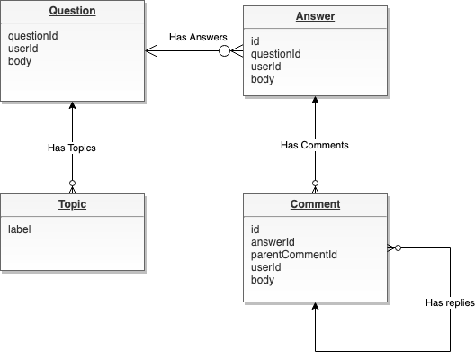
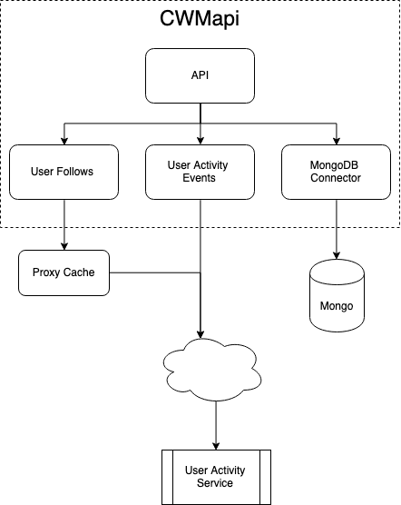

# CWMAPI
## Overview
CWMapi is the CWORA Message service.  It provides scalable and stateless access to the CWORA message data.  The current implentation is using MongoDB, but the service and API has been modeled such that it would be easy to move to a different NOSQL store such as Cassandra or Riak.

## CWORA Data Model
The CWORA app is built around topics, questions, answers, and comments.  Topics are tags appolied to questions.  They are free-form, and can be created and applied without any restrictions.  If a new question has a topic that is no in the topic table, it will be added.  A question has text, user id, zero or more answers, and zero or more topic tags.  Answers have text, user id, and zero or more comments.  Comments have text, user id, and zero or more nested comments (replies).  

The cwmapi data model maps cleany to CWORA.  There is a Question table, an Answer table, and a Comment table. In addition, there is a Topic table.  This is shown in the figure below.

## cwmapi API
The cwmapi API was built using OpenIO 3.0, which provides for both always current and upto date [online documentation](https://app.swaggerhub.com/apis-docs/jonathannah/cwmapi/1), and code stubs for both client and server.

## cwmapi Architecture
###Database
cwmapi was built with MongoDB as the NoSQL data engine.  However, the API is separated from the data model so that it will be possible to move to a different NoSQL engine such as Cassandra in the future.  After considering some of the queries needed to run CWORA, it is believed that MongoDB will not scale suitably.  Thus, it would be necessary to move to Cassandra or some other AP database to achieve high scale.

### Major Components
cwmapi has 5 moajor components: API, Database Connector, User Follows Connector, User Activity Notifications, and a User Follows Connector Proxy and cache service.  These are shown in the image and discussed further below.

#### API
The API layer receives incomming requests.  DFor each request, it will do JWT token authentication, and parameter validation.  The request is then forwarded to the appropriate database connector to do the query.  The API layer supports DELETE, GET, POST, and PUT, for CRUD operations.  Since every component in the CWORA datamode has children, a "depth" parameter is provided.  This enables, for example, question queries that return only questions, andf to optionally include answers and comments.  

The API was built using [OpenAPI](https://app.swaggerhub.com/apis/jonathannah/cwmapi/1).  From the OpenAPI YAML, [API documentation is published](https://app.swaggerhub.com/apis-docs/jonathannah/cwmapi/1#/default/getQuestions), and the template golang code was generated (using [OpenAPI-Generator](https://github.com/OpenAPITools/openapi-generator))
####MongoDB Database Connector
The MongoDB Database Connector puts the queries into the correct form for Mongo queries and executes the queries.  Some queries are multi-part.  For example, to query all questions with nesting level == 1 (questions and answers), it is necessary to first query questions, and then for each question, query answers.
####User Follows Connector
In order to fill complex queries, requests must be sent to the User Activity Service frequently.  For example, one question query is to get all the questions that have topics that the current user (per JWT token) has followed.  First, it is necessary to call the User Activity Service to get the followed topics.  Then the results are used in the question query (all questions with topics x,y,z).  Theses requests are handled by the User Follows Connector.
####User Activity Notifications
(Notice: this feature did not make lockdown).  

When users do any CWORA operation, for example, posting a question, that activity needs to be tracked.  The User Activity Service maintains this data.  Any user activity on cwmapi will cause an activity event to be fired to the User Activity Service. 
####User Follows Proxy and Cache
(Notice: this feature is functional, and tested, but integration with the User Activity Service did not make lockdown, and so the caching component is disabled).  

Because most cwmapi queries require a call to the User Activity Service for followe topics, an proxn and cache service was added to cwmapi.  This service is using BigCache in-app memory caching for user's followed topics.  To clear stale data, the User Activity Servicde must POST a clear cache event for a user any time they modify followed topics.

